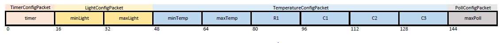

# EBFNflora

*EBFNflora* è il nome di una applicazione embedded per Arduino Uno (ATmega328) inizialmente pensata per monitorare l'ambiente in cui si trova una pianta. Il microcontrollore monitora ad un intervallo regolare - configurabile dall'utente - la quantità di luce, la qualità dell'aria e la temperatura esterna. In caso di anomalie viene mostrato sul display un apposito messaggio di warning accompagnato dal blink di un LED e dal beep di un active buzzer. I valori di soglia per ogni sensore sono anch'essi configurabili.


All'avvio vengono inizializzati i registri per la comunicazione seriale (UART), i pin digitali, l'LCD (usata [libreria esterna](http://winavr.scienceprog.com/example-avr-projects/avr-gcc-4-bit-and-8-bit-lcd-library.html)), l'interfaccia ADC (definita appositamente in [adc.c](src/adc.c)) e gli external interrupt (INT0, INT1).

```c
EIMSK = (1<<INT1)|(1<<INT0); //turn ON INT0 and INT1
EICRA = (1<<ISC11)|(1<<ISC10)|(1<<ISC01)|(1<<ISC00);
```

L'mcu legge da EEPROM i parametri necessari per misurare la temperatura, quelli dell'ultima inizializzazione. A questo punto, dopo un messaggio di benvenuto sul display, si entra in un loop in cui si chiede ripetutamente all'utente (output sul display) se intende configurare i parametri di misurazione in EEPROM e nel frattempo si visualizza sull'LCD la temperatura corrente.

```c
while(waitingForOutput){
	LCDclr();
	printOnLCD("Setup sensors?");

	float logR2, R2, T, Tc;
	uint16_t Vo = adc_read(temp_pin);
	//current thermistor resistance 
	R2 = R1 * (1023.0 / (float)Vo - 1.0);
	logR2 = log(R2);
	T = (1.0 / (C1 + C2*logR2 + C3*logR2*logR2*logR2));
	Tc = T - 273.15;
	
	char msg[BUFFER_SIZE];
	sprintf(msg, "Temp: %.1f C", Tc);
	LCDGotoXY(0,1);
	printOnLCD(msg);
		
	delayMs(500);
}
```

Se viene premuto il bottone collegato alla porta PD2 (INT0) la variabile globale `reset` è settata a 1, altrimenti se viene premuto quello relativo alla porta PD3 (INT1), `reset` è settato a 0. In entrambi i casi il flag `waitingForOutput` è settato a 0 causando così l'uscita dal ciclo while.

```c
ISR(INT0_vect){ //external interrupt service routine
	if(waitingForOutput && DigIO_getValue(buttonLeft) == HIGH){
		reset = 1;
		waitingForOutput = 0;
	}
	else if(!waitingForOutput && !EEPROM_params_ready && DigIO_getValue(buttonLeft) == HIGH){
		EEPROM_params_ready = 1;
	}
}

ISR(INT1_vect){ //external interrupt service routine
	if(waitingForOutput && DigIO_getValue(buttonRight) == HIGH){
		reset = 0;
		waitingForOutput = 0;
	}
	else if(!waitingForOutput && !EEPROM_params_ready && DigIO_getValue(buttonRight) == HIGH){
		EEPROM_params_ready = 1;
	}
}
```

Nel primo caso (`reset = 1`) l'MCU installa gli handler per i pacchetti binari e attende dall'utente l'arrivo dei ConfigPacket contenenti i nuovi parametri di configurazione (continua a flushare l'input buffer), salva i singoli valori in EEPROM, ognuno in blocchi da 16 byte come di seguito riportato. Sono state scritte funzioni apposite per lettura/scrittura da/su EEPROM definite in [eepromParams.c](src/eepromParams.c)

**N.B**: dopo aver premuto il pushbutton associato a INT0 [sendParams.c](host/sendParams.c) è il programma da eseguire su host per scegliere e inviare i nuovi settaggi. Si veda più avanti il paragrafo sulla comunicazione seriale.



* `uint16_t timer`: intervallo in ms tra due successivi controlli dei sensori
* `uint16_t minLight`
* `uint16_t maxLight`
* `uint16_t minTemp`
* `uint16_t maxTemp`
* `float R1`: resistenza in Ω impiegata per il calcolo della temperatura, nel circuito 10000
* `float C1, C2, C3`: costanti, vedere [Termistore](#Termistore)
* `uint16_t maxPoll`: massimo valore della qualità dell'aria tollerato, consigliabile 150-170

**N.B**: [eeprom_test.c](eeprom_test.c) è un programma di debugging scritto per leggere i valori correnti in EEPROM.

Una volta che i parametri sono stati modificati, l'utente può premere un qualunque pushbutton per uscire dal loop (il flag `EEPROM_params_ready` è settato a 1) e disinstallare gli handler dei pacchetti.

Nel secondo caso (`reset = 0`) l'MCU va subito a salvare i valori già presenti in EEPROM nelle variabili globali, cioé quelli dell'ultimo setup.

```c
timer = get_EEPROM_timer();
minLight = get_EEPROM_minLight();
maxLight = get_EEPROM_maxLight();
minTemp = get_EEPROM_minTemp();
maxTemp = get_EEPROM_maxTemp();
R1 = get_EEPROM_r1();
C1 = get_EEPROM_c1();
C2 = get_EEPROM_c2();
C3 = get_EEPROM_c3();
maxPoll = get_EEPROM_maxPoll();
```

A questo punto: 

* vengono disattivati i bit dei registri per gli external interrupt perché non saranno più utilizzati
* viene inizializzato il timer basato sul TIMER1

```c
//disable interrupts globally to turn OFF INT0 and INT1
cli();
EIMSK = 0x00;
EICRA = 0x00;
Timers_init(); //initialize timer
sei(); //enable interrupts globally

struct Timer* timerSensors = Timer_create("timer_0", timer, timerFn, NULL); 
Timer_start(timerSensors);
```

Il valore memorizzato in `timer` è usato per richiamare ogni "timer" ms la funzione `timerFn()` che si occupa di effettuare il sensing dell'ambiente.

```c
void timerFn(void* args){
	LCDclr();
	if(i==0){
		controlLight();
		i++;
		return;
	}
	else if(i==1){
		controlTemp();
		i++;
		return;
	}
	else if(i==2){
		controlPoll();
		i = 0;
		return;
	}
}
```

**N.B**: il TIMER1 è stato settato in [timer.c](src/timer.c) con un prescaler di 1024 ed è quindi in grado di supportare una durata massima di 4195 ms. Un valore maggiore causa un overflow e azzera così il timeout.

Il microcontrollore entra infine in un loop vuoto ed eseguirà la funzione `timerFn()` ad ogni compare interrupt.

## Comunicazione seriale

### Lato Microcontrollore

Nei paragrafi precedenti si è visto che si instaura una comunicazione seriale binaria a pacchetti solo per trasmettere i parametri di misurazione. Esistono 4 tipi di ConfigPacket:

```c
typedef struct TimerConfigPacket{
	PacketHeader header;
	uint32_t duration;
} TimerConfigPacket;

typedef struct LightConfigPacket{
	PacketHeader header;
	uint16_t minLight;
	uint16_t maxLight;
} LightConfigPacket;

typedef struct TemperatureConfigPacket{
	PacketHeader header;
	uint16_t minTemp;
	uint16_t maxTemp;
	float r1;
	float c1;
	float c2;
	float c3;
} TemperatureConfigPacket;

typedef struct PollutionConfigPacket{
	PacketHeader header;
	uint16_t maxPoll;
} PollutionConfigPacket;
```

Ognuno dei precedenti è dotato di una funzione "onReceive" che estrae il payload, carica in EEPROM i nuovi parametri e li mostra sull'LCD come feedback per l'utente. A titolo di esempio ecco la funzione per il PollutionConfigPacket:

```c
PacketStatus PollutionConfigPacket_onReceive(PacketHeader* header, void* args __attribute__((unused))){
	PollutionConfigPacket* p = (PollutionConfigPacket*) header;
	int maxPoll = p->maxPoll;
	set_EEPROM_maxPoll(maxPoll);
	char buffer[8];
	sprintf(buffer, "%d", maxPoll);
	LCDclr();
	printOnLCD(buffer);
	return Success;
}
```

### Lato Host

Il programma [sendParams.c](host/sendParams.c) avvia di fatto una procedura guidata per l'inserimento dei parametri. Chiede un parametro alla volta, lo legge da stdin, lo converte da char* al tipo corretto, prepara il singolo pacchetto e lo invia. Di seguito un esempio con il LightConfigPacket.

```c
printf("Insert min light: ");
read_from_stdin();
uint16_t minLight = atoi(inputString);

printf("Insert max light: ");
read_from_stdin();
uint16_t maxLight = atoi(inputString);

LightConfigPacket p1 = { {LIGHT_CONFIG_PACKET_TYPE, LIGHT_CONFIG_PACKET_SIZE, 0}, minLight, maxLight };
PacketHandler_sendPacket(&packet_handler, (PacketHeader*) &p1);
flushOutputBuffer(fd);
```

L'host non ha funzioni di ricezione "onReceive" per i pacchetti perché si occupa solo di inviare valori. Naturalmente - per come è stato progettato il [main.c](main.c) - saranno ignorati i pacchetti inviati senza aver premuto il pushbutton associato a INT0 oppure dopo che gli external interrupt sono stati disabilitati.

## Sensori

### Fotoresistore

Il sensore di luce varia la propria resistenza a seconda della luce che cattura. Nel progetto è collegato al pin ADC5.

```c
void controlLight(void){
	uint16_t photocell_value= adc_read(light_pin); 
	char msg[BUFFER_SIZE];
	
	if(photocell_value<minLight){
		printOnLCD("LOW light");
		sprintf(msg, "Light: %d", photocell_value);
		LCDGotoXY(0,1);
		printOnLCD(msg);
		error_blink_sound();
	}
	else if(photocell_value>maxLight){
		printOnLCD("HIGH light");
		sprintf(msg, "Light: %d", photocell_value);
		LCDGotoXY(0,1);
		printOnLCD(msg);
		error_blink_sound();
	}
}
```

La lettura del pin analogico restituisce un valore tra 0 e 1023. Se non ricade nell'intervallo `[minLinght,maxLight]` viene invocata la funzione `error_blink()` e stampato un 
messaggio di errore.

### Sensore qualità dell'aria MQ 135

Il sensore di inquinamento (MQ 135) indica la quantità di gas presente nell'ambiente circostante.
Esso è composto da un esoscheletro di acciaio che circonda un elemento "recettore" il quale si ionizza al contatto con i gas variando la corrente che fa passare. Nel progetto è collegato al pin ADC3.

```c
void controlPoll(void){
	uint16_t air_value= adc_read(poll_pin); 
	char msg[BUFFER_SIZE];
		
	if(air_value>maxPoll){
		sprintf(msg, "Polluted air");
		printOnLCD(msg);
		sprintf(msg, "Air: %d", air_value);
		LCDGotoXY(0,1);
		printOnLCD(msg);
		error_blink_sound();
	}
}
```

La lettura del pin analogico restituisce un valore tra 0 e 1023. Se è inferiore a maxPoll viene invocata la funzione `error_blink()` e stampato un messaggio di errore. Alcuni valori di riferimento:

- condizioni normali: circa 100-150
- alcol: circa 700
- polveri sottili: circa 750

### Termistore

Il termistore varia la sua resistenza in base alla temperatura grazie al materiale di cui è composto: ossido di metallo o ceramica. Nel progetto è collegato al pin ADC0.

```c
void controlTemp(void){	
	float logR2, R2, T, Tc;
	uint16_t Vo = adc_read(temp_pin);
	//current thermistor resistance 
	R2 = R1 * (1023.0 / (float)Vo - 1.0);
	logR2 = log(R2);
	T = (1.0 / (C1 + C2*logR2 + C3*logR2*logR2*logR2));
	Tc = T - 273.15;
	
	char msg[BUFFER_SIZE];
	
	if(Tc<minTemp){
		printOnLCD("LOW temp");
		sprintf(msg, "Temp: %.1f C", Tc);
		LCDGotoXY(0,1);
		printOnLCD(msg);
		error_blink_sound();	
	}else if(Tc>maxTemp){
		printOnLCD("HIGH temp");
		sprintf(msg, "Temp: %.1f C", Tc);
		LCDGotoXY(0,1);
		printOnLCD(msg);
		error_blink_sound();
	}
}
```

La variabile Tc indica la temperatura attuale.
* la variabile V0 memorizza il valore di ritorno di `adc_read()`;
* tramite una formula basata sull'equazione di Steinhart-Hart `R2 = R1 * (1023.0 / (float)Vo - 1.0)` si ricava la resistenza attuale del termistore;
* la formula `T = (1.0 / (C1 + C2*logR2 + C3*logR2*logR2*logR2))` converte il valore della resistenza R2 in gradi Kelvin;
* `Tc = T - 273.15` lo converte in °C.

Se la temperatura attuale non è nell'intervallo `[minTemp,maxTemp]` viene invocata la funzione `error_blink()` e viene stampato un messaggio di errore.
